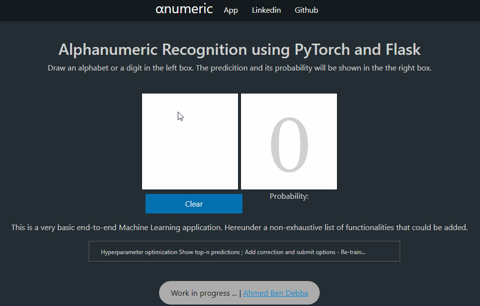
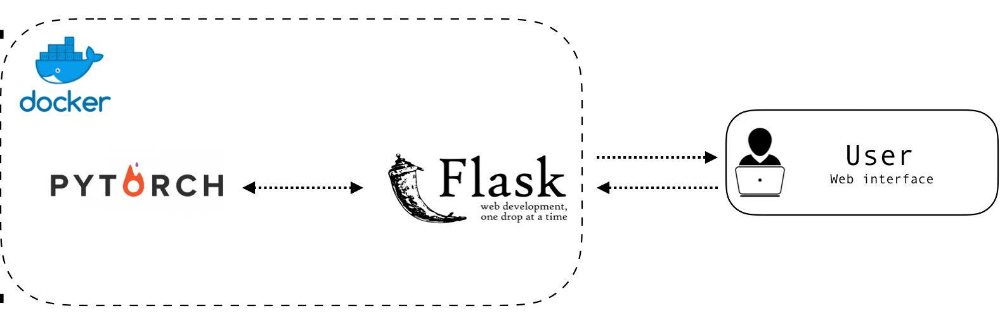

# Train and Deploy Machine Learning Model With Web Interface - Docker, PyTorch & Flask

- Serverless version: https://alphanumeric-recognition-ml2jklb2fa-ew.a.run.app/



## Architecture


## Running on Local/cloud machine

Clone the repo and build the docker image

```
sudo docker build -t flaskml .
```

NB: if you have MemoryError while installing PyTorch in the container, please consider adding 2G swap to your virtual machine (https://linuxize.com/post/how-to-add-swap-space-on-ubuntu-18-04/)

Then after that you can run the container while specefying the absolute path to the app 

```
sudo docker run -i -t --rm -p 8888:8888 -v **absolute path to app directory**:/app flaskml
```

This will run the application on localhost:8888

You can use serveo.net or Ngrok to port the application to the web.

## Useful files 

- Training and saving the CNN model : https://gist.github.com/ahmedbendebba1/f30815efa2f4c0882e9b9531035f5d14
- Visualize the inference : https://colab.research.google.com/github/ahmedbendebba1/ML-web-app/blob/master/emnist_inference_cnn.ipynb

## Info

This a generic web app for ML models. You can update your the network and weights by changing the following files. 

```
app/ml_model/network.py
app/ml_model/trained_weights.pth
```


---
Ahmed Ben Debba
